# Design Document

## Overview

Community Hero is a mobile-first civic issue reporting platform built as a Progressive Web App (PWA) for citizens and a companion web dashboard for officials. Its defining capability is a **five-agent LangGraph pipeline** (Intake → Validation → Routing → Resolution, plus a nightly Insights batch) that automates the journey of a report from raw media to resolved municipal action, with a human-readable `Reasoning_Explanation` persisted at every AI decision point.

This design translates the 21 requirements into a concrete technical architecture using the confirmed stack:

- **Frontend (citizen):** React + TypeScript + Vite PWA, React Three Fiber (3D globe / Impact Dashboard), Tailwind CSS + Framer Motion, Google Maps JS API, Web Speech API, service worker for offline.
- **Frontend (official):** React web dashboard with analytics, exports, and the 3D Impact Dashboard.
- **Backend:** Python FastAPI (REST + WebSocket), PostgreSQL (issues/users/metrics), Redis (caching + pub/sub), ChromaDB (RAG vector store).
- **Agentic layer:** LangGraph orchestrating the 5 agents; Google Gemini Pro Vision for image analysis; Claude for agentic reasoning/validation; RAGAS + DeepEval for AI evaluation; Vertex AI for predictive model hosting.
- **Google platform:** Maps Platform, Gemini Pro Vision, Vertex AI, Firebase (auth + push + offline sync), Cloud Run.
- **DevOps:** GitHub Actions CI/CD with quality gates, Docker + Cloud Run, Streamlit internal metrics dashboard.

The design is organized around three pillars expressed in the requirements: **Transparency** (Req 16 — every AI decision exposes reasoning), **Accountability** (Req 3, 4 — department routing, SLA tracking, proof-of-fix), and **Community Participation** (Req 8, 11 — validation, XP, badges, leaderboards).

### Design Goals and Non-Functional Targets

| Concern | Target | Source |
|---|---|---|
| Report submission (4G) | < 3 s to confirmation | Req 7.11, 18.1 |
| Pipeline intake-to-Issue_Object | < 60 s (demo: < 10 s) | Req 1.9, 21.2 |
| Status push latency | < 2 s over WebSocket | Req 9.2 |
| Live map pulse | < 3 s of report receipt | Req 10.4 |
| Google API rate limit | 100 calls/min/key, queued | Req 18.3, 18.4 |
| Google API cache TTL | 3600 s in Redis | Req 18.5, 18.6 |
| Accessibility | WCAG 2.1 AA, 44px targets | Req 17 |
| Privacy | Pseudonymous issues, 365-day retention | Req 14.2, 19 |

## Architecture

### High-Level System Architecture

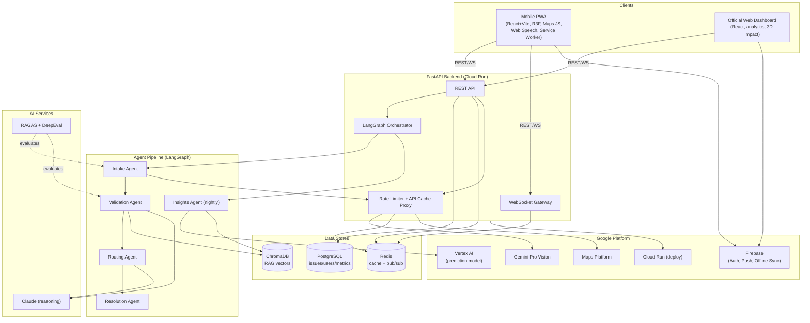

### Architectural Layers

1. **Presentation layer** — The PWA and dashboard are decoupled SPAs. They never call Google AI services directly; all privileged/billed calls (Gemini, Maps server-side geocoding, Vertex) are proxied through the backend rate limiter so the 100 calls/min/key budget (Req 18.3) is centrally enforced. Firebase Auth and push are used directly from clients.
2. **API layer** — FastAPI exposes REST for CRUD and command operations and a WebSocket gateway for live updates. The WebSocket gateway subscribes to Redis pub/sub channels and fans out status changes and map pulses (Req 9.2, 10.4).
3. **Orchestration layer** — A LangGraph orchestrator owns the per-report state graph and the nightly batch graph. It persists state to PostgreSQL between every node (Req 6.4).
4. **Agent layer** — Five agents, each a LangGraph node with its own retry policy. Agents are pure-logic-first: deterministic computations (priority score, SLA, severity bounds, clustering geometry) live in testable pure functions; non-deterministic AI calls (Gemini, Claude, Vertex) are isolated behind service adapters that can be mocked.
5. **Data layer** — PostgreSQL is the system of record; Redis provides the Google-API cache and the pub/sub backbone; ChromaDB stores embeddings for similarity retrieval.

### Rate Limiting and API Cache Proxy (Req 18.3–18.6)

All outbound Google API calls flow through a single `GoogleApiProxy` component:

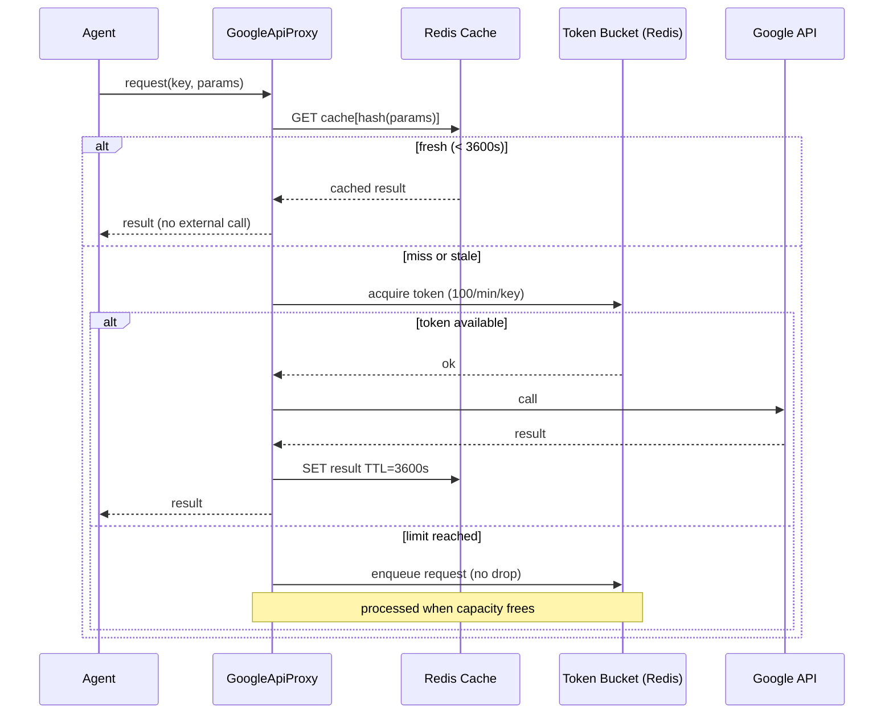

The token bucket is implemented in Redis (per API key) so the limit holds across horizontally scaled Cloud Run instances. Queued requests are never dropped (Req 18.4).

## Components and Interfaces

### Frontend Components (Mobile PWA)

| Component | Responsibility | Requirements |
|---|---|---|
| `SplashGlobe` | 3D globe intro ≤ 3 s, then onboarding (≤ 5 screens, skippable, once) | 20.1, 20.2 |
| `HomeFeed` | Issues within 5 km, pulse map refresh ≤ 30 s | 20.3 |
| `ReportFlow` | Fixed steps: camera → AI analysis → form → submit | 7, 20.4, 20.5 |
| `CameraCapture` | Photo + ≤ 60 s video, live Gemini overlay (≤ 2 s update) | 7.1, 7.2 |
| `LiveOverlay` | Shows suggested Issue_Type + Severity over camera | 7.2 |
| `LocationPicker` | GPS auto-fill ≤ 5 s, manual pin-drop fallback | 7.4–7.6 |
| `VoiceInput` | Web Speech API → editable text, graceful fallback | 7.7, 7.8, 17.1, 17.4 |
| `ReasoningPanel` | Shows categorization + Reasoning_Explanation pre-submit | 7.10, 16.1 |
| `OfflineQueueManager` | Local queue (cap 50), persistence, ordered sync | 15 |
| `IssueDetail` | Status tracker, votes, comments, status history, ETA | 9.4–9.6, 20.6 |
| `VotePanel` | Upvote/downvote once, up to 3 photo evidence ≤ 10 MB | 8.3–8.5 |
| `ImpactDashboard3D` | R3F city map, pins, heatmap, pulses, filters, WebGL fallback | 10 |
| `ProfileScreen` | XP total, badges, report history | 20.7 |
| `LeaderboardScreen` | Zone ranking, highlighted Community Hero | 20.8, 11 |
| `NotificationCenter` | Reverse-chronological alerts, ≤ 5 s appearance | 20.9 |
| `LiveStatusClient` | WebSocket subscribe + reconnection + resync | 9.2, 9.7 |

### Backend Service Interfaces

```python
# Pipeline orchestration
class PipelineOrchestrator:
    def submit_report(self, report: ReportInput) -> IssueId: ...
    def run_per_report_graph(self, issue_id: IssueId) -> PipelineResult: ...
    def run_nightly_insights(self, run_time: datetime) -> InsightsResult: ...

# Agent contracts (each returns updated state + reasoning)
class IntakeAgent:
    def process(self, state: PipelineState) -> PipelineState: ...
class ValidationAgent:
    def process(self, state: PipelineState) -> PipelineState: ...
class RoutingAgent:
    def process(self, state: PipelineState) -> PipelineState: ...
class ResolutionAgent:
    def monitor(self, issue: Issue, now: datetime) -> ResolutionAction: ...
    def accept_fix(self, issue: Issue, proof: PhotoProof) -> Issue: ...
class InsightsAgent:
    def run(self, zones: list[Zone], as_of: datetime) -> list[Prediction]: ...

# Pure-logic services (no external calls — primary PBT surface)
class PriorityService:
    def time_elapsed_factor(self, hours: int) -> float: ...        # Req 3.3
    def priority_score(self, severity: int, votes: int, hours: int) -> float: ...  # Req 3.2
class SlaService:
    def sla_deadline(self, issue_type: str, assigned_at: datetime) -> datetime: ...  # Req 3.4
class StateMachine:
    def can_transition(self, frm: Status, to: Status) -> bool: ...  # Req 9.1
    def transition(self, issue: Issue, to: Status) -> Issue: ...
class GeoService:
    def distance_m(self, a: LatLng, b: LatLng) -> float: ...
    def find_cluster(self, issue: Issue, others: list[Issue]) -> GeoCluster | None: ...  # Req 2.4
class XpService:
    def award(self, citizen: Citizen, event: XpEvent) -> Citizen: ...  # Req 11
    def revoke(self, citizen: Citizen, event: XpEvent) -> Citizen: ...  # Req 11.4
class LeaderboardService:
    def rank(self, citizens: list[Citizen]) -> list[RankedCitizen]: ...  # Req 11.6, 11.7
class VoteService:
    def cast(self, issue: Issue, citizen_id: str, vote: VoteKind) -> VoteResult: ...  # Req 8.8, 8.9
class OfflineQueue:
    def enqueue(self, report: QueuedReport) -> EnqueueResult: ...  # Req 15.2
    def next_batch(self) -> list[QueuedReport]: ...  # FIFO, Req 15.3
```

### REST API Design

| Method & Path | Purpose | Requirements |
|---|---|---|
| `POST /api/reports` | Submit report (multipart media + metadata), triggers pipeline | 1, 7, 18.1 |
| `POST /api/reports/batch-sync` | Sync offline queue (ordered, idempotent by client_id) | 15.3, 15.4 |
| `GET /api/issues?bbox=&radius=&filters=` | Query issues (feed, map, dashboard filters) | 9, 10.5, 20.3 |
| `GET /api/issues/{id}` | Issue detail incl. status history, reasoning, ETA | 9.4–9.6, 16, 20.6 |
| `GET /api/issues/{id}/reasoning` | All Reasoning_Explanations + escalation log | 16.2–16.5 |
| `POST /api/issues/{id}/votes` | Cast upvote/downvote (once), optional photo evidence | 8.3–8.9 |
| `POST /api/issues/{id}/fix` | Department fix report + photo proof | 4.4–4.6 |
| `GET /api/citizens/{id}/profile` | XP, badges, report history | 20.7 |
| `GET /api/leaderboard?zone=` | Zone ranking + Community Hero | 11.6–11.8, 20.8 |
| `GET /api/dashboard/metrics?period=` | Official aggregate metrics | 13.1–13.4 |
| `POST /api/dashboard/export` | CSV / Google Sheets export | 13.5, 13.6 |
| `GET /api/predictions?zone=` | Zone predictions + reasoning | 12, 5 |
| `GET /api/reports/monthly-pdf?month=` | Municipal PDF report | 12.5, 12.6 |
| `POST /api/privacy/delete-request` | Citizen data deletion request | 19.4 |
| `POST /api/auth/session` | Establish session (Firebase token exchange) | 14.1, 14.6 |

All mutating endpoints require a valid Firebase session (Req 14.1, 14.4); official-only endpoints enforce the Official role (Req 14.3).

### WebSocket Channels (Redis pub/sub backed)

| Channel | Payload | Requirements |
|---|---|---|
| `issue.status.{issue_id}` | New status + status-history entry | 9.2 |
| `map.pulse.{zone}` | New-issue pulse (lat/lng, 10 s animation) | 10.4 |
| `feed.{zone}` | Feed marker refresh stream | 20.3 |
| `notifications.{citizen_id}` | In-app alerts (reverse-chron) | 20.9 |
| `leaderboard.{zone}` | Ranking updates | 11.6 |

On reconnect, `LiveStatusClient` re-subscribes and fetches current state via `GET /api/issues/{id}` to reconcile any missed events (Req 9.7).

## The Five-Agent LangGraph Pipeline

### Pipeline Topology

```mermaid
graph LR
    START((Report<br/>submitted)) --> INTAKE[Intake Agent]
    INTAKE -->|persist state + reasoning| VALIDATE[Validation Agent]
    VALIDATE -->|persist state + reasoning| ROUTE{Status<br/>VERIFIED?}
    ROUTE -->|yes| ROUTING[Routing Agent]
    ROUTE -->|no, awaiting votes| WAIT["Hold at REPORTED<br/>(re-enter on vote/cluster)"]
    ROUTING -->|persist state + reasoning| RESOLUTION[Resolution Agent]
    RESOLUTION -->|monitor loop| RESOLUTION
    RESOLUTION --> DONE((RESOLVED))

    subgraph Nightly Batch (00:00–04:00)
        CRON((Scheduler)) --> INSIGHTS[Insights Agent]
        INSIGHTS --> PUBLISH[Publish heatmap to Impact Dashboard]
    end
```

The per-report graph runs Intake → Validation → Routing → Resolution in that exact order, advancing only on success (Req 6.1). The Validation Agent may hold an issue at `REPORTED` until the upvote threshold (10) or a geo-cluster escalation forces `VERIFIED` (Req 2.5, 2.6, 8.6); the graph re-enters the routing branch when that event fires. The Insights Agent runs as an independent nightly graph (Req 6.5) and never mutates per-report issue status (Req 6.6).

### Shared Pipeline State

LangGraph passes a typed `PipelineState` between nodes; it is persisted to PostgreSQL after each node completes (Req 6.4).

```python
class PipelineState(TypedDict):
    issue_id: str
    status: Status                       # REPORTED | VERIFIED | ASSIGNED | IN_PROGRESS | RESOLVED
    issue_object: IssueObject | None     # produced by Intake
    media_refs: list[MediaRef]
    location: LatLng
    location_hint: str | None
    severity: int                        # 1..5
    issue_type: str
    confidence: float                    # 0.0..1.0 (Vision)
    flags: dict                          # analysis_failed, low_confidence, unmapped_category, needs_manual_confirm
    linked_issue_ids: list[str]
    geo_cluster_id: str | None
    department_id: str | None
    priority_score: float | None
    sla_deadline: datetime | None
    reasoning_log: list[ReasoningExplanation]   # appended at each stage
    last_successful_agent: str
    error: AgentError | None
    retry_counts: dict[str, int]         # per-agent attempt counters
```

### Per-Agent Design

**Intake Agent (Req 1, 7.3)**
- Validates the upload: rejects unsupported formats or files > 50 MB before any work (Req 1.8).
- Calls `Vision_Service` (Gemini Pro Vision) via the rate-limited proxy to extract `Issue_Type`, `Severity` (clamped to integer 1–5, Req 1.3), and `location_hint`.
- Builds the structured `IssueObject` JSON with a `Reasoning_Explanation` of 1–1000 characters (Req 1.2, 1.4).
- If Vision confidence < 0.70, sets `needs_manual_confirm` (Req 1.5).
- If Vision call fails or exceeds 30 s, builds the `IssueObject` from text + location and records `analysis_failed` (Req 1.6).
- Sets status to `REPORTED` on completion (Req 1.7); total processing ≤ 60 s (Req 1.9).

**Validation Agent (Req 2)**
- Queries ChromaDB (`RAG_Store`) for up to 50 same-type issues within 200 m, within 5 s (Req 2.1). On query failure/timeout it keeps the issue at `REPORTED`, records the error, and never discards the issue (Req 2.2).
- Links corroborating reports (same type, ≤ 200 m) (Req 2.3).
- Marks a `Geo_Cluster` for escalation when ≥ 3 same-type issues fall within 200 m and sets the representative issue to `VERIFIED` (Req 2.4, 2.6).
- Sets `VERIFIED` and forwards to Routing when upvotes ≥ 10 (Req 2.5).
- Records reasoning with matched issue IDs, type, measured distance, and thresholds applied (Req 2.7, 2.8). Claude (`Reasoning_Service`) composes the human-readable justification from the structured decision facts.

**Routing Agent (Req 3)**
- Maps `Issue_Type` to exactly one Department within 5 s of `VERIFIED` (Req 3.1); falls back to the configured default Department with `unmapped_category = true` when no mapping exists (Req 3.6).
- Computes `Priority_Score = Severity × community_votes × time_elapsed_factor` (Req 3.2), where `time_elapsed_factor` ramps from 1.0 at 0 h to 10.0 at ≥ 168 h derived from whole hours elapsed (Req 3.3).
- Assigns `SLA_Deadline = now + category_duration` where duration is an integer 1–720 hours mapped to the category (Req 3.4).
- Sets status to `ASSIGNED` within 5 s of the `VERIFIED` event (Req 3.5).
- Records reasoning naming type, department, severity, votes, factor, and resulting score (Req 3.7, 3.8).

**Resolution Agent (Req 4)**
- Evaluates each `ASSIGNED`/`IN_PROGRESS` issue against its `SLA_Deadline` at least every 60 minutes (Req 4.1) via a scheduled monitor loop.
- On SLA breach, sends a department reminder via webhook within 5 minutes (Req 4.2), retrying up to 3 times at ≥ 5-minute intervals and logging each failure (Req 4.3).
- Requires photo proof for a fix; status stays unchanged until proof is accepted (Req 4.4). Valid proof (readable image ≤ 10 MB) transitions to `RESOLVED` (Req 4.5); missing/oversized/invalid proof is rejected with a reason and status unchanged (Req 4.6).
- On `RESOLVED`, awards 50 XP + any earned badge to the reporter (Req 4.7).
- Records reasoning including `SLA_Deadline` and elapsed time since assignment (Req 4.8).

**Insights Agent (Req 5, 12)**
- Nightly: clusters recurring issues (≥ 3 same-type within a Zone over trailing 90 days) grouped by Zone and type (Req 5.1).
- Generates a predictive heatmap (likelihood 0.0–1.0 per Zone) using historical data + contextual factors (rainfall, road age, traffic) hosted on Vertex AI (Req 5.2, 12.1).
- Records reasoning listing each contributing factor and the estimated likelihood (Req 5.3, 12.7).
- Publishes to the Impact Dashboard within 60 minutes of clustering (Req 5.4), retrying up to 3 times and retaining the prior heatmap on failure (Req 5.7).
- Marks low-confidence predictions when a Zone has < 3 issues or < 30 days of data, or when contextual factors are missing (Req 5.5, 5.6); omits and flags missing-factor predictions per Req 12.2.
- Sends proactive department alerts when probability ≥ threshold (default 70%) within 60 s (Req 12.3), retrying 3× on delivery failure (Req 12.4).

### Pipeline Failure and Retry Handling (Req 6.2, 6.3)

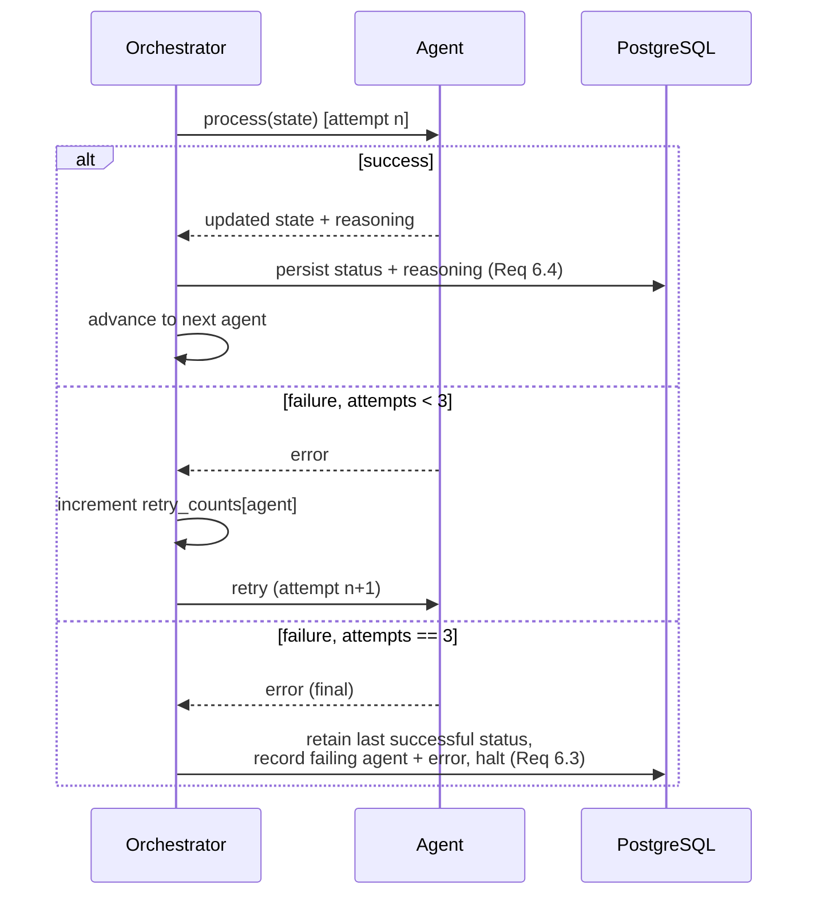

Every node persists `status` and `reasoning_log` before the next node begins (Req 6.4). A failed agent retries up to 3 times (Req 6.2); after the third failure the issue is held at its last successful status, the failing agent and error are recorded, and the sequence halts (Req 6.3). Insights failures during the nightly batch record an error and never alter per-report status (Req 6.6).

### Reasoning_Explanation Persistence Points

| Stage | What is persisted | Requirements |
|---|---|---|
| Intake | Why Issue_Type + Severity chosen (1–1000 chars) | 1.2, 1.4 |
| Validation | Matched IDs, type, distance, thresholds | 2.7, 2.8 |
| Routing | Type, department, severity, votes, factor, score | 3.7, 3.8 |
| Resolution | SLA_Deadline, elapsed time, status change/reminder | 4.8 |
| Insights | Contributing factors + likelihood | 5.3, 12.7 |
| Escalation log | Each escalation event + trigger + reasoning | 16.5 |

Each `ReasoningExplanation` row is retained ≥ 365 days (Req 16.3) and surfaced in the same view as the decision it explains (Req 16.1, 16.2). If a reasoning record cannot be retrieved, the UI shows an "explanation unavailable" message and still renders the decision (Req 16.4).

## Data Models

### Entity Overview

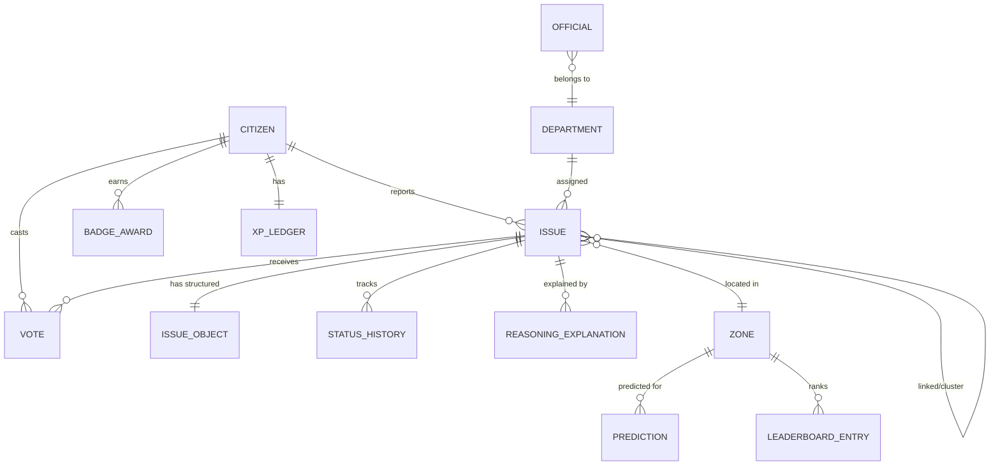

### Core Schemas

```python
class Status(str, Enum):
    REPORTED = "REPORTED"
    VERIFIED = "VERIFIED"
    ASSIGNED = "ASSIGNED"
    IN_PROGRESS = "IN_PROGRESS"
    RESOLVED = "RESOLVED"

# Forward-only ordering used by StateMachine (Req 9.1)
STATUS_ORDER = [Status.REPORTED, Status.VERIFIED, Status.ASSIGNED,
                Status.IN_PROGRESS, Status.RESOLVED]

class Issue:
    id: str
    reporter_pseudonym: str          # pseudonymous only (Req 14.2, 19.2)
    issue_type: str
    severity: int                    # 1..5 (Req 1.3)
    status: Status
    location: LatLng
    zone_id: str
    department_id: str | None
    priority_score: float | None
    sla_deadline: datetime | None
    community_votes: int             # net/total upvotes
    linked_issue_ids: list[str]
    geo_cluster_id: str | None
    flags: dict                      # analysis_failed, low_confidence, unmapped_category
    estimated_resolution_hours: float | None  # ML ETA (Req 9.4, 9.5)
    created_at: datetime
    closed_at: datetime | None

class IssueObject:                   # structured JSON from Intake (Req 1.2)
    issue_id: str
    issue_type: str
    severity: int
    location_hint: str | None
    reasoning_explanation: str       # 1..1000 chars
    confidence: float                # 0.0..1.0
    analysis_failed: bool

class Citizen:
    id: str
    pseudonym: str                   # exposed identifier
    firebase_uid: str                # never exposed (Req 19.2, 19.5)
    last_known_location: LatLng | None
    total_xp: int                    # >= 0 always (Req 11.4)
    locality_zone_id: str

class Official:
    id: str
    firebase_uid: str
    department_id: str
    role: str = "OFFICIAL"

class Department:
    id: str
    name: str
    issue_types: list[str]           # mapping source (Req 3.1)
    sla_hours_by_type: dict[str, int]  # 1..720 (Req 3.4)
    webhook_url: str
    is_default: bool                 # default routing target (Req 3.6)

class Vote:
    issue_id: str
    citizen_id: str
    kind: VoteKind                   # UPVOTE | DOWNVOTE
    photo_evidence: list[MediaRef]   # <= 3, each <= 10 MB (Req 8.4)
    created_at: datetime
    # unique (issue_id, citizen_id) -> at most one vote (Req 8.8, 8.9)

class Badge:
    id: str
    name: str                        # Pothole Hunter | Water Guardian | Street Light Hero
    issue_type: str
    threshold: int = 5               # resolved issues in category (Req 11.5)

class BadgeAward:
    citizen_id: str
    badge_id: str
    awarded_at: datetime
    # unique (citizen_id, badge_id) -> at most once (Req 11.5)

class XpLedgerEntry:
    citizen_id: str
    event_type: str                  # REPORT(+10) | VALIDATE(+5) | RESOLVED(+50) | REVOKE(-)
    source_id: str                   # report/issue id (idempotency key)
    delta: int
    created_at: datetime
    # unique (citizen_id, event_type, source_id) -> one-time awards (Req 11.1–11.3)

class LeaderboardEntry:
    zone_id: str
    citizen_id: str
    total_xp: int
    xp_reached_at: datetime          # tie-break key (Req 11.7)
    rank: int

class ReasoningExplanation:
    id: str
    issue_id: str
    stage: str                       # INTAKE | VALIDATION | ROUTING | RESOLUTION | INSIGHTS
    text: str
    factors: dict                    # primary input factors (Req 16.1, 16.2)
    created_at: datetime
    retain_until: datetime           # >= created_at + 365d (Req 16.3)

class StatusHistory:
    issue_id: str
    from_status: Status | None
    to_status: Status
    changed_at: datetime             # chronological display (Req 9.6)

class Zone:
    id: str
    name: str                        # e.g., "Serilingampalle, Hyderabad"
    polygon: GeoPolygon

class Prediction:
    zone_id: str
    issue_type: str
    likelihood: float                # 0.0..1.0 (Req 5.2) / 0..100% (Req 12.1)
    horizon_days: int = 30
    factors: dict                    # rainfall, road_age, traffic
    missing_factors: list[str]
    low_confidence: bool             # Req 5.5, 5.6
    reasoning_explanation: str
    generated_at: datetime

class QueuedReport:                  # Offline_Queue item (Req 15)
    client_id: str                   # idempotency key for sync
    payload: ReportInput
    media_blobs: list[bytes]
    queued_at: datetime              # FIFO ordering (Req 15.3)
    retry_count: int                 # max 5 (Req 15.5, 15.6)
```

### Issue Lifecycle State Machine (Req 9.1)

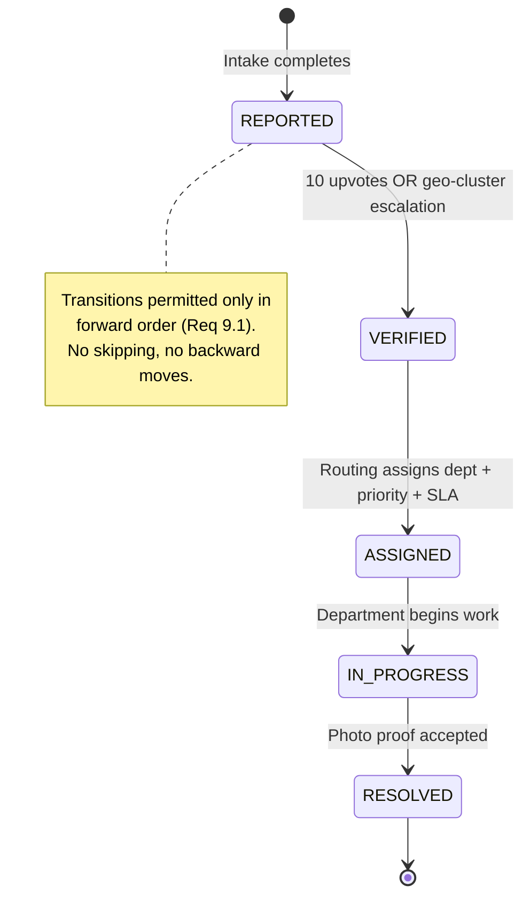

Each transition writes a `StatusHistory` row and publishes to `issue.status.{id}` (Req 9.2, 9.6). The `StateMachine.can_transition` function enforces that a move is legal only if the target is the immediate next state in `STATUS_ORDER`.

## Feature Component Designs (7 Core Features)

### Feature 1: Smart Issue Reporting (Req 7, 20.4)

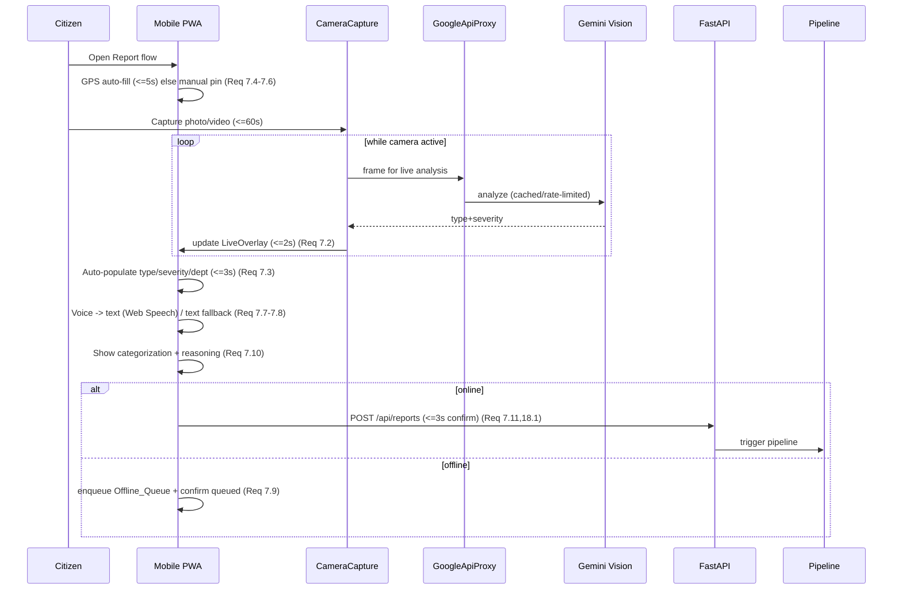

The flow advances only after each step completes (Req 20.4). If AI analysis exceeds 15 s or fails, the app shows an "analysis unsuccessful" indication, retains the captured image and data, and lets the citizen continue to the form manually (Req 20.5). Submission that misses the 3 s budget retains entered data and offers retry without re-entry (Req 18.2).

### Feature 2: Community Validation (Req 8)

- On report creation, `Notification_Service` (Firebase push) notifies every citizen whose last known location is within 300 m within 60 s (Req 8.1), retrying failed sends up to 3× before recording a per-citizen failure (Req 8.2).
- `VotePanel` exposes one upvote and one downvote per validator per issue (Req 8.3). `VoteService.cast` enforces at-most-one vote per (issue, citizen): a second vote is rejected and the original retained (Req 8.8, 8.9).
- Up to 3 photo evidence files (≤ 10 MB each); oversize or over-limit attachments are rejected with an error while previously attached photos are unchanged (Req 8.4, 8.5).
- Reaching 10 upvotes sets `VERIFIED` and forwards to Routing (Req 8.6). Each recorded upvote awards 5 XP to the reporting citizen (Req 8.7, 11.2).

### Feature 3: Real-Time Tracking (Req 9)

- `LiveStatusClient` subscribes to `issue.status.{id}`; status changes push within 2 s (Req 9.2). Map pins map one-to-one to the five statuses with five distinct colors (Req 9.3). ML ETA is shown in hours, or a "no estimate available" indication when absent (Req 9.4, 9.5). Issue detail renders full chronological status history (Req 9.6). Lost connections trigger re-subscribe + resync (Req 9.7).

### Feature 4: 3D Impact Dashboard (Req 10)

- `ImpactDashboard3D` renders a Three.js/R3F city map of up to 5,000 active pins within 5 s of load (Req 10.1). Pins are color-coded red/amber/green by severity status grouping (Req 10.2). An optional density heatmap overlay intensifies with issue count per region (Req 10.3). New issues animate a 10 s pulse within 3 s of receipt via `map.pulse.{zone}` (Req 10.4). Filters for time/category/status/zone apply conjunctively (all must match) (Req 10.5); a zero-match filter shows a "no issues match" message and an empty map (Req 10.6). When WebGL is unsupported, a non-3D fallback list of active issues is shown with an error message (Req 10.7).

### Feature 5: Gamification Engine (Req 11)

- `XpService` awards via the idempotent `XpLedger`: +10 per validated report (once, Req 11.1), +5 per distinct validation of another's issue (once, Req 11.2), +50 per resolved reported issue (once, Req 11.3). Deletion/invalideation revokes the prior award without letting total XP drop below 0 (Req 11.4).
- Category badges (Pothole Hunter / Water Guardian / Street Light Hero) awarded at ≥ 5 resolved issues in that category, at most once each (Req 11.5).
- `LeaderboardService` recomputes locality ranking within 5 s of an XP change, descending by XP, breaking ties by who reached the total earliest (Req 11.6, 11.7). Month-end awards the Community Hero recognition to the top-ranked citizen per locality using the same tie-break (Req 11.8).

### Feature 6: Predictive Insights (Req 5, 12)

- Vertex AI hosts the prediction model consumed by the Insights Agent. Predictions cover a 30-day horizon as a probability, using rainfall, infrastructure age, and traffic factors (Req 12.1). Missing required factors omit the Zone prediction and identify which are missing (Req 12.2). Probability ≥ threshold (default 70%) sends a proactive department alert within 60 s (Req 12.3), retrying 3× on failure (Req 12.4). Month-end auto-generates a municipal PDF within 24 h (Req 12.5); failures retain data and surface an indication (Req 12.6). Predictions display reasoning with each factor's relative influence (Req 12.7).

### Feature 7: Official Impact Dashboard (Req 13)

- Default trailing-30-day metrics: total reported, total resolved, average resolution time in hours to one decimal (Req 13.1). Per-department SLA compliance % = resolved-within-SLA ÷ total-resolved, to one decimal (Req 13.2). Zone heatmap shaded by volume with up/down/neutral trend vs. the preceding equal-length period (Req 13.3). Engagement metrics: unique reporters, comment count, upvote count, scoped to the period (Req 13.4). Export to CSV/Google Sheets within 10 s for up to 100,000 rows (Req 13.5); failed/slow exports retain displayed metrics and offer retry (Req 13.6). Empty periods show zeros plus a "no data" indication (Req 13.7).

## AI Transparency Design (Req 16)

Every AI decision produces a structured `ReasoningExplanation` containing the decision outcome plus primary input factors. The backend persists these alongside the issue with `retain_until = created_at + 365 days` (Req 16.3). The UI binds reasoning into the same view as the decision:

- Intake categorization → `ReasoningPanel` pre-submit (Req 16.1, 7.10).
- Validation escalation/linking, Routing, Insights predictions → inline reasoning in their respective views (Req 16.2).
- Auto-escalation events are recorded in an **escalation log** (trigger condition + reasoning), displayed on issues that underwent auto-escalation (Req 16.5).
- If reasoning is unavailable/unretrievable, the UI shows "reasoning unavailable" and still renders the decision unchanged (Req 16.4).

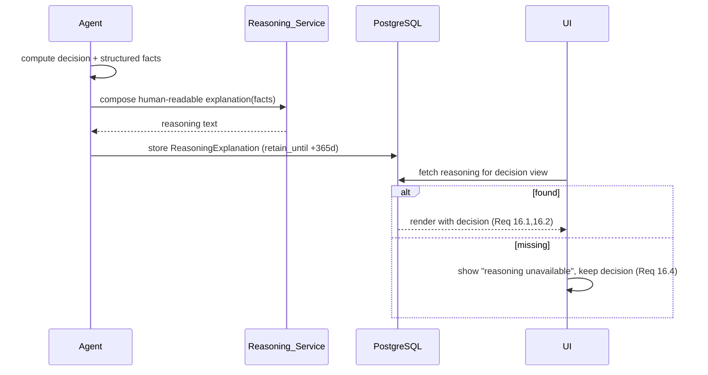

## Offline-First / PWA Design (Req 15)

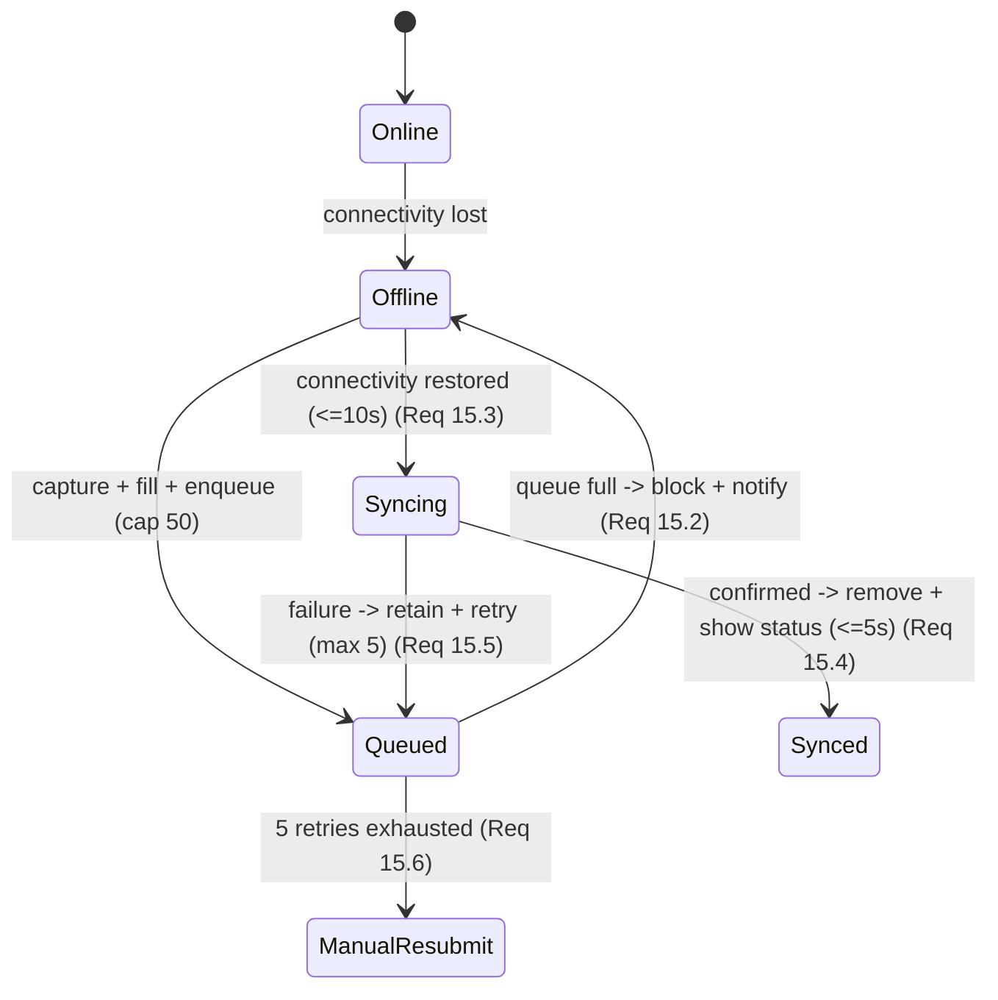

- Service worker caches the app shell so the PWA is installable without an app store (Req 15.7, 21.1).
- `OfflineQueueManager` persists queued reports (incl. media) to IndexedDB across restarts (Req 15.1), enforces a 50-item cap (Req 15.2), and syncs oldest-first (FIFO) within 10 s of reconnect (Req 15.3).
- Firebase offline sync + `client_id` idempotency keys prevent duplicate submissions on retry. Each report retries up to 5 times across connectivity events (Req 15.5); after 5 failures it stays queued and prompts manual resubmission (Req 15.6).

## Cross-Cutting Concerns

### Authentication, Identity, and Privacy (Req 14, 19)

- Firebase Auth issues tokens exchanged for backend sessions within 5 s, scoped by account type (Req 14.1). Citizen/Official roles gate features; official-only routes deny citizen accounts (Req 14.3); unauthenticated requests to protected features are denied with an auth prompt (Req 14.4).
- Five consecutive failed sign-ins lock the account for 15 minutes (Req 14.6); idle sessions end after 30 minutes (Req 14.7).
- Issues store only a pseudonymous reporter identifier; name/email/phone are never exposed on an issue or to citizen-facing interfaces (Req 14.2, 19.2, 19.5). The backend rejects storage of any personal field not defined for reporting/validation/notification (Req 19.1).
- Personal data is deleted/anonymized after the 365-day retention window post-closure (Req 19.3) and within 30 days of a deletion request, while pseudonymous issue records are retained (Req 19.4).

### Performance (Req 18)

- Submission path is optimized for < 3 s on 4G: media uploaded to storage with a returned reference, pipeline runs asynchronously, and the client confirms on report acceptance rather than pipeline completion (Req 18.1).
- The `GoogleApiProxy` enforces 100 calls/min/key with queueing (no drops) and Redis caching with a 3600 s TTL for all Google API results (Req 18.3–18.6).

### Accessibility (Req 17)

- All interactive tap targets ≥ 44×44 CSS px (Req 17.2). Normal text ≥ 4.5:1 contrast; large text and UI boundaries ≥ 3:1 (WCAG 2.1 AA, Req 17.3); high-contrast mode ≥ 7:1 (Req 17.5). Voice input transcribes to editable text; failure within 10 s shows an error and retains existing text (Req 17.1, 17.4).

## AI Evaluation Pipeline (RAGAS + DeepEval)

The agentic layer is continuously evaluated in CI and on a schedule:

- **RAGAS** evaluates the Validation Agent's RAG retrieval (context precision/recall, answer relevance) against a curated golden set of issue-similarity cases.
- **DeepEval** evaluates Intake categorization accuracy, Reasoning_Explanation faithfulness (does the explanation reflect the actual decision factors?), and hallucination checks on Routing/Insights reasoning.
- Evaluation runs as a GitHub Actions quality gate: a regression below configured thresholds fails the build. Results feed the Streamlit internal metrics dashboard.

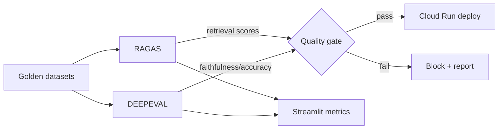

## Predictive Model Design (Vertex AI)

- A gradient-boosted / regression model hosted on Vertex AI estimates per-Zone issue likelihood from features: trailing-90-day issue counts by type, rainfall, infrastructure (road) age, and traffic. Output is a probability surface consumed by the Insights Agent and rendered as the heatmap.
- Low-confidence handling: Zones with < 3 issues or < 30 days of data, or missing factors, are flagged `low_confidence` (Req 5.5, 5.6) and predictions with missing required factors are omitted at the dashboard (Req 12.2).
- The model is versioned; the Insights batch records the model version in each prediction's reasoning for auditability.

## Deployment Architecture

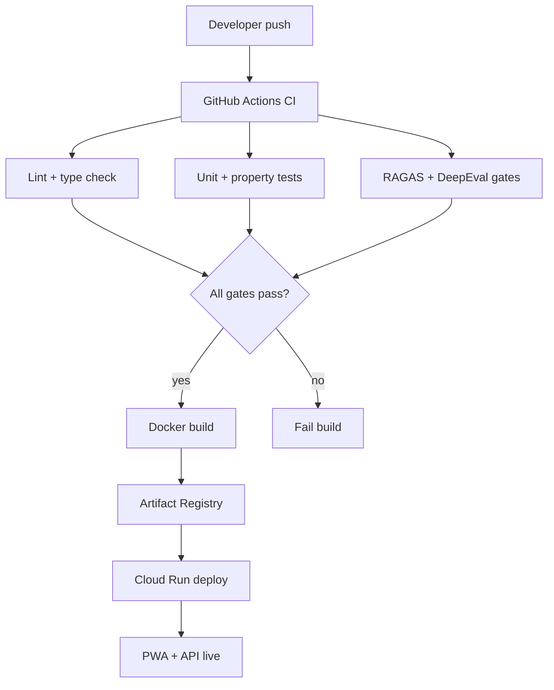

- Backend and frontend are containerized with Docker and deployed to Cloud Run (serverless, autoscaling). PostgreSQL (Cloud SQL), Redis (Memorystore), and ChromaDB run as managed/containerized services.
- CI/CD quality gates: lint, type-check, unit + property-based tests (≥ 100 iterations each), and AI evaluation thresholds must all pass before deploy.
- **Seeded demo data (Serilingampalle, Hyderabad):** a seed script provisions the Zone polygon, a default set of departments with SLA mappings, sample citizens with pseudonyms, and a pre-loaded pothole issue primed near the 10-upvote threshold so judges can drive the full report → verify → resolve → reward flow live (Req 21). The PWA loads interactive within 5 s on 4G with no install (Req 21.1).

## Demo Scenario Flow (Req 21)

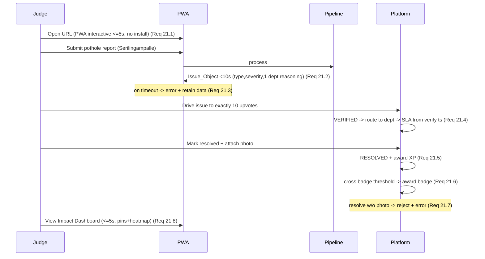

## Correctness Properties

*A property is a characteristic or behavior that should hold true across all valid executions of a system — essentially, a formal statement about what the system should do. Properties serve as the bridge between human-readable specifications and machine-verifiable correctness guarantees.*

The properties below are derived from the prework analysis. Criteria that are timing/perf-bound (e.g., < 3 s submission, < 2 s push), pure UI rendering, or external-service wiring are covered by integration/smoke tests in the Testing Strategy rather than property tests. Redundant criteria have been consolidated (e.g., the three XP awards into one idempotent-award property).

### Property 1: Severity is always a bounded integer

*For any* Vision_Service result (including out-of-range or non-integer raw values), the Intake_Agent's produced Severity SHALL be an integer in the inclusive range 1 to 5.

**Validates: Requirements 1.3**

### Property 2: Reasoning_Explanation length bounds

*For any* report processed by the Intake_Agent, the produced Issue_Object's Reasoning_Explanation SHALL have length between 1 and 1000 characters inclusive.

**Validates: Requirements 1.4**

### Property 3: Low-confidence flag threshold

*For any* Vision_Service confidence value in [0.0, 1.0], the Intake_Agent SHALL set the manual-confirmation flag if and only if the confidence is strictly below 0.70.

**Validates: Requirements 1.5**

### Property 4: Intake resilience produces an Issue_Object

*For any* report where the Vision_Service fails or times out, the Intake_Agent SHALL still produce a non-null Issue_Object built from text and location data, with the analysis_failed indicator set true; and on successful intake the Issue Status SHALL be REPORTED.

**Validates: Requirements 1.6, 1.7**

### Property 5: Upload validation rejects invalid files without side effects

*For any* submitted file, the Intake_Agent SHALL reject it (creating no Issue_Object) if and only if its format is unsupported or its size exceeds 50 MB; otherwise it SHALL proceed.

**Validates: Requirements 1.8**

### Property 6: RAG retrieval result set is well-formed

*For any* Issue_Object and candidate set, the Validation_Agent's retrieval result SHALL contain at most 50 issues, all of the same Issue_Type, and all located within 200 meters of the issue.

**Validates: Requirements 2.1**

### Property 7: RAG failure preserves the issue

*For any* pipeline state, if the RAG_Store query fails or times out, the Validation_Agent SHALL retain the issue at Status REPORTED, record an error indication, and SHALL NOT discard the Issue_Object.

**Validates: Requirements 2.2**

### Property 8: Corroborating reports are linked exactly when co-located and same-type

*For any* new issue and candidate set, a candidate SHALL be linked as corroborating if and only if it shares the Issue_Type and lies within 200 meters.

**Validates: Requirements 2.3**

### Property 9: Geo-cluster escalation threshold

*For any* set of issues, a Geo_Cluster SHALL be marked for escalation (and its representative issue set to VERIFIED) if and only if three or more issues of the same Issue_Type lie within a 200-meter radius.

**Validates: Requirements 2.4, 2.6**

### Property 10: Upvote threshold transitions to VERIFIED

*For any* issue with a given upvote count, the system SHALL set Status to VERIFIED and forward to the Routing_Agent if and only if the upvote count is greater than or equal to 10.

**Validates: Requirements 2.5, 8.6, 21.4**

### Property 11: Priority_Score formula

*For any* Severity (integer 1–5), community_votes (integer 0–1,000,000), and elapsed hours, the computed Priority_Score SHALL equal Severity × community_votes × time_elapsed_factor(hours).

**Validates: Requirements 3.2**

### Property 12: time_elapsed_factor is bounded and monotonic

*For any* whole hours elapsed, time_elapsed_factor SHALL be in [1.0, 10.0], SHALL equal 1.0 at 0 hours, SHALL equal 10.0 at or beyond 168 hours, and SHALL be non-decreasing in elapsed hours.

**Validates: Requirements 3.3**

### Property 13: SLA_Deadline derivation

*For any* Issue_Type and assignment timestamp, the SLA_Deadline SHALL equal the timestamp plus the category-mapped duration, and that duration SHALL be an integer number of hours between 1 and 720 inclusive.

**Validates: Requirements 3.4**

### Property 14: Routing assigns exactly one department and advances to ASSIGNED

*For any* VERIFIED issue, the Routing_Agent SHALL assign exactly one responsible Department and set Status to ASSIGNED; if no mapping exists it SHALL assign the configured default Department, set unmapped_category true, and still compute Priority_Score and SLA_Deadline.

**Validates: Requirements 3.1, 3.5, 3.6**

### Property 15: Proof-of-fix governs resolution transition

*For any* fix report, the Resolution_Agent SHALL set Status to RESOLVED if and only if accepted photo proof is a readable image no larger than 10 MB; otherwise it SHALL keep the Status unchanged and return a rejection reason.

**Validates: Requirements 4.4, 4.5, 4.6, 21.7**

### Property 16: Reminder retry cap

*For any* sequence of webhook reminder failures, the Resolution_Agent SHALL attempt delivery at most 3 times and SHALL record each delivery failure.

**Validates: Requirements 4.3**

### Property 17: Idempotent XP awards

*For any* XP-earning event (report +10, validation +5, resolution +50) applied any number of times for the same (citizen, event_type, source) key, the citizen's total XP SHALL increase by the event amount exactly once.

**Validates: Requirements 11.1, 11.2, 11.3, 4.7, 8.7, 21.5**

### Property 18: XP non-negativity under revocation

*For any* sequence of XP award and revoke operations, a revoke SHALL reverse exactly its corresponding prior award and the citizen's total XP SHALL never fall below 0.

**Validates: Requirements 11.4**

### Property 19: Category badge threshold and idempotency

*For any* citizen and category, the corresponding Badge SHALL be awarded if and only if the citizen has 5 or more RESOLVED issues in that category, and SHALL be awarded at most once.

**Validates: Requirements 11.5**

### Property 20: Leaderboard ordering and tie-break

*For any* set of citizens with XP totals and XP-reached timestamps, the Leaderboard ranking SHALL be a total order sorted by descending XP, breaking ties in favor of the citizen who reached that XP total earliest; and the Community Hero per locality SHALL be the rank-1 citizen under this order.

**Validates: Requirements 11.6, 11.7, 11.8**

### Property 21: Vote uniqueness per citizen per issue

*For any* sequence of votes by a single citizen on a single issue, at most one vote SHALL be counted; a subsequent vote SHALL be rejected and the original vote retained.

**Validates: Requirements 8.3, 8.8, 8.9**

### Property 22: Photo evidence attachment limits

*For any* sequence of photo-evidence attachments to a vote, an attachment SHALL be accepted only while the total count stays at or below 3 and each photo is at most 10 MB; an invalid attachment SHALL be rejected with an error and leave previously attached photos unchanged.

**Validates: Requirements 8.4, 8.5**

### Property 23: Proximity notification recipient set

*For any* reported issue and population of citizens with last known locations, the set of citizens targeted for a push notification SHALL be exactly those whose location is within 300 meters of the issue.

**Validates: Requirements 8.1**

### Property 24: Forward-only state transitions

*For any* pair of statuses (from, to) over the ordered lifecycle REPORTED → VERIFIED → ASSIGNED → IN_PROGRESS → RESOLVED, a transition SHALL be permitted if and only if `to` is the immediate successor of `from`; backward and skipping transitions SHALL be rejected.

**Validates: Requirements 9.1**

### Property 25: Status-to-color is a bijection

*For any* Issue Status, the rendered map-pin color SHALL be a total function assigning each of the five statuses a distinct color (one-to-one).

**Validates: Requirements 9.3, 10.2**

### Property 26: Status history is chronological

*For any* Issue, the rendered Status history SHALL be ordered non-decreasingly by timestamp.

**Validates: Requirements 9.6**

### Property 27: Dashboard filters are conjunctive

*For any* set of issues and any combination of time/category/status/zone filters, the displayed result SHALL contain exactly the issues matching all selected filter values; a zero-match filter SHALL yield an empty result.

**Validates: Requirements 10.5, 10.6**

### Property 28: Recurring-cluster detection window

*For any* dated set of issues, a (Zone, Issue_Type) pair SHALL be classified as a recurring cluster if and only if it has three or more issues within the trailing 90 days.

**Validates: Requirements 5.1**

### Property 29: Prediction likelihood is bounded

*For any* feature inputs, a generated prediction likelihood SHALL lie within [0.0, 1.0] (equivalently 0–100%).

**Validates: Requirements 5.2, 12.1**

### Property 30: Prediction confidence and omission rules

*For any* Zone, the prediction SHALL be marked low_confidence when the Zone has fewer than 3 issues or less than 30 days of historical data or is missing one or more contextual factors; and SHALL be omitted (with missing factors identified) when a required input factor is unavailable.

**Validates: Requirements 5.5, 5.6, 12.2**

### Property 31: Reasoning completeness per stage

*For any* AI decision, the recorded Reasoning_Explanation SHALL contain the stage-required fields: Validation → matched issue IDs, Issue_Type, measured distance, thresholds; Routing → Issue_Type, Department, Severity, community_votes, time_elapsed_factor, Priority_Score; Resolution → SLA_Deadline and elapsed time since assignment; Insights → each contributing factor and the likelihood; and each auto-escalation event SHALL be logged with its trigger condition and reasoning.

**Validates: Requirements 2.7, 3.7, 4.8, 5.3, 12.7, 16.5**

### Property 32: Reasoning retention window

*For any* stored Reasoning_Explanation, its retain_until SHALL be at least 365 days after its created_at.

**Validates: Requirements 16.3**

### Property 33: Pipeline executes agents in order and advances only on success

*For any* successful per-report run, the recorded agent execution order SHALL be exactly Intake → Validation → Routing → Resolution, advancing to the next agent only after the current agent completes successfully, and each stage's Status and Reasoning_Explanation SHALL be persisted before the next agent begins.

**Validates: Requirements 6.1, 6.4**

### Property 34: Pipeline retry cap and halt on final failure

*For any* injected agent failure, the Pipeline SHALL retry the failing agent at most 3 times; after the third failure it SHALL retain the issue at its last successful Status, record the failing agent identifier and an error indication, and halt further sequence execution for that issue.

**Validates: Requirements 6.2, 6.3**

### Property 35: Nightly Insights isolation

*For any* run of the Insights_Agent (including a failed run), the Status of issues in the per-report sequence SHALL remain unchanged.

**Validates: Requirements 6.5, 6.6**

### Property 36: Offline queue capacity

*For any* sequence of offline report submissions, the Offline_Queue SHALL store at most 50 reports; once full it SHALL block additional reports and signal that the queue is full, retaining queued reports across app restarts.

**Validates: Requirements 15.1, 15.2, 7.9**

### Property 37: Offline sync is FIFO

*For any* set of queued reports, synchronization SHALL submit them in queued order (oldest first).

**Validates: Requirements 15.3, 15.4**

### Property 38: Sync retry cap

*For any* queued report that repeatedly fails to sync, the Sync_Service SHALL retry at most 5 times while preserving all report data, after which it SHALL retain the report and signal that manual resubmission is required.

**Validates: Requirements 15.5, 15.6**

### Property 39: Rate limiting never exceeds budget and never drops

*For any* burst of external Google API requests for a key, the proxy SHALL dispatch at most 100 calls per minute and the total number of dispatched requests SHALL equal the total submitted (no request is dropped).

**Validates: Requirements 18.3, 18.4**

### Property 40: API cache freshness

*For any* external Google API request, the proxy SHALL serve from the Redis cache if and only if a cached result exists and is less than 3600 seconds old; otherwise it SHALL issue the call and store the result with a 3600-second expiry.

**Validates: Requirements 18.5, 18.6**

### Property 41: Access control by role

*For any* (account role, protected endpoint) pair, access SHALL be granted if and only if the role is authorized for that endpoint; unauthenticated requests and citizen requests to official-only routes SHALL be denied with protected data withheld.

**Validates: Requirements 14.1, 14.3, 14.4**

### Property 42: Sign-in lockout threshold

*For any* sequence of sign-in attempts for an account, sign-in SHALL be locked for 15 minutes exactly when 5 consecutive failures occur.

**Validates: Requirements 14.6**

### Property 43: Pseudonymity in citizen-facing output

*For any* Issue or citizen-facing serialization, the output SHALL expose only the pseudonymous identifier and SHALL NOT contain the reporter's name, email address, or phone number; and the Platform SHALL reject storage of any personal field not defined for reporting, validation, or notification.

**Validates: Requirements 14.2, 19.1, 19.2, 19.5**

### Property 44: Data deletion anonymizes PII while retaining pseudonymous records

*For any* citizen with associated issues, processing a deletion request SHALL remove or irreversibly anonymize all personal data linked to that citizen, retain the pseudonymous issue records, and return a deletion confirmation.

**Validates: Requirements 19.4**

### Property 45: Contrast ratios meet WCAG thresholds

*For any* themed text/background or UI-boundary color pair, the computed contrast ratio SHALL meet its required minimum: 4.5:1 for normal text, 3:1 for large text and UI boundaries, and 7:1 in high-contrast mode.

**Validates: Requirements 17.3, 17.5**

### Property 46: Home feed radius filter

*For any* citizen location and set of issues, the Home Feed SHALL contain exactly the issues located within a 5 km radius of the citizen.

**Validates: Requirements 20.3**

### Property 47: Dashboard aggregate metrics

*For any* set of resolved issues over a period, the average resolution time SHALL equal the arithmetic mean of resolution durations rounded to one decimal place, and per-department SLA compliance SHALL equal (issues resolved within SLA ÷ total resolved for that department) as a percentage in [0.0, 100.0] rounded to one decimal place.

**Validates: Requirements 13.1, 13.2**

### Property 48: Zone trend indicator

*For any* pair of consecutive equal-length periods, the Zone trend indicator SHALL be upward when current volume exceeds the prior, downward when it is less, and neutral when equal.

**Validates: Requirements 13.3**

## Error Handling

The system follows a consistent principle: **never lose citizen data, always preserve the last good state, and always surface a reason.**

### Pipeline-Level Errors

| Failure | Handling | Requirements |
|---|---|---|
| Agent fails | Retry up to 3×; after 3, hold at last successful status, record agent + error, halt | 6.2, 6.3 |
| State persistence | Persist status + reasoning before next agent; on persistence failure, do not advance | 6.4 |
| Insights nightly fails | Record error, retain prior heatmap, do not alter per-report status | 5.7, 6.6 |

### Agent-Level Errors

| Failure | Handling | Requirements |
|---|---|---|
| Vision fails / >30 s | Build Issue_Object from text+location, set analysis_failed | 1.6 |
| Invalid upload (format / >50 MB) | Reject, return validation error, create no Issue_Object | 1.8 |
| RAG query fails | Keep REPORTED, record error, never discard | 2.2 |
| No department mapping | Default department + unmapped_category flag, continue | 3.6 |
| Invalid/missing fix proof | Reject, keep status, return rejection reason | 4.6 |
| Webhook reminder unacked | Retry ≤ 3× at ≥ 5 min, log each failure | 4.3 |
| Missing prediction factors | Mark low_confidence / omit + identify missing | 5.6, 12.2 |
| Heatmap publish fails | Retry ≤ 3×, retain prior heatmap | 5.7 |

### Client-Level Errors

| Failure | Handling | Requirements |
|---|---|---|
| GPS unavailable | Prompt manual pin-drop, retain entered data | 7.5 |
| Voice unsupported/fails | Fall back to text, retain entered text | 7.8, 17.4 |
| Offline at submit | Queue (cap 50), confirm queued | 7.9, 15.2 |
| Submission > 3 s | Retain data, show delayed indication, allow retry | 18.2 |
| Sync fails | Retain in queue, retry ≤ 5×, then manual-resubmit | 15.5, 15.6 |
| WebSocket dropped | Re-subscribe + resync current status | 9.7 |
| WebGL unsupported | Error message + non-3D fallback list | 10.7 |
| Reasoning unavailable | "Reasoning unavailable" message, render decision unchanged | 16.4 |
| Export fails / > 10 s | Retain metrics, show retryable error | 13.6 |

### Auth and Privacy Errors

| Failure | Handling | Requirements |
|---|---|---|
| Invalid credentials | Deny with invalid-credentials indication | 14.5 |
| 5 consecutive failures | Lock account 15 minutes | 14.6 |
| Idle 30 minutes | End session, require re-auth | 14.7 |
| Unauthorized access | Deny, withhold data, prompt auth | 14.4, 19.5 |

## Testing Strategy

Property-based testing **is appropriate** for Community Hero: the agent layer and platform rules are rich in pure functions and universal invariants (priority scoring, the lifecycle state machine, XP ledger, leaderboard ordering, geo-clustering, vote dedup, offline-queue ordering, rate limiting, caching). AI calls and I/O are isolated behind adapters so the surrounding logic is deterministically testable with mocks.

### Dual Testing Approach

- **Property tests** verify the 48 universal properties above across generated inputs.
- **Unit tests** cover specific examples, edge cases, and error conditions (e.g., fallback prompts, "no data" indications, reasoning-unavailable messaging).
- **Integration tests (1–3 examples)** cover timing/perf and external wiring: < 3 s submission (18.1), < 2 s status push (9.2), < 5 s session (14.1), 5,000-pin render (10.1), nightly scheduling cadence (4.1, 6.5), webhook/alert delivery, export timing (13.5), PWA cold load (21.1).
- **Smoke tests** verify configuration and setup: Firebase auth wiring, Cloud Run health, seed-data presence for the Serilingampalle demo.
- **AI evaluation gates** (RAGAS + DeepEval) verify retrieval quality and reasoning faithfulness as CI quality gates.

### Property-Based Test Configuration

- Use a property-based testing library for each language: **Hypothesis** for the Python/FastAPI/agent layer and **fast-check** for the TypeScript/PWA layer. Do not implement PBT from scratch.
- Each property test runs a **minimum of 100 iterations**.
- Each property test is tagged with a comment referencing its design property, in the format: **Feature: community-hero, Property {number}: {property_text}**.
- Each correctness property (1–48) is implemented by a **single** property-based test.
- Generators must exercise edge cases inline: out-of-range severities and confidences, boundary upvote counts (9/10/11), boundary file sizes (just under/over 50 MB and 10 MB), elapsed-hours boundaries (0/167/168/169), empty datasets, missing factors, duplicate votes, and queue-capacity boundaries (49/50/51).

### Test-to-Property Mapping Highlights

| Area | Properties | Library |
|---|---|---|
| Intake logic | 1–5 | Hypothesis |
| Validation / clustering | 6–10, 28 | Hypothesis |
| Routing / priority / SLA | 11–14 | Hypothesis |
| Resolution / proof | 15, 16 | Hypothesis |
| Gamification | 17–20 | Hypothesis |
| Voting / notifications | 21–23 | Hypothesis |
| State machine / tracking | 24–26 | Hypothesis |
| Dashboards / filters / metrics | 27, 47, 48 | Hypothesis / fast-check |
| Insights / predictions | 29–31 | Hypothesis |
| Reasoning / transparency | 31, 32 | Hypothesis |
| Pipeline orchestration | 33–35 | Hypothesis |
| Offline / PWA | 36–38 | fast-check |
| Performance proxy | 39, 40 | Hypothesis |
| Auth / privacy | 41–44 | Hypothesis |
| Accessibility palette | 45 | fast-check |
| Home feed | 46 | fast-check |
